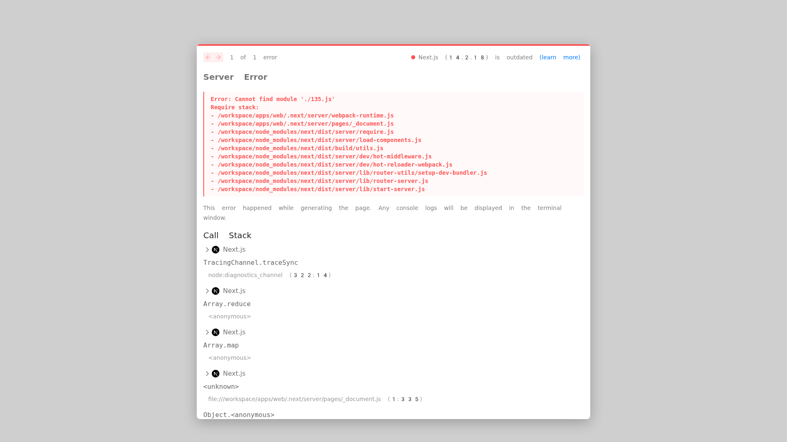
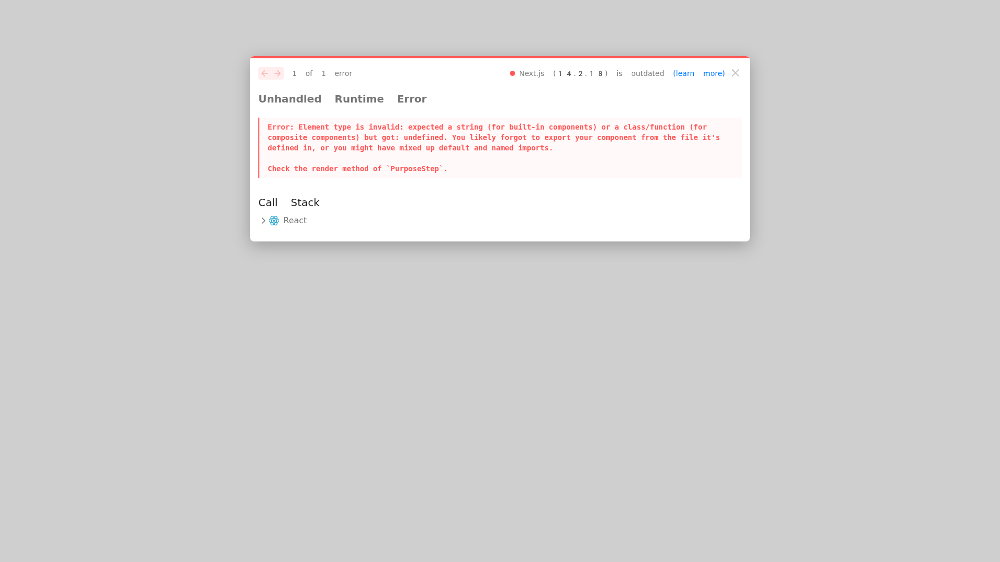

# TurboMarket

🚀 **AI-powered email marketing that actually converts**

TurboMarket is a modern SaaS platform that helps growth teams create compelling email campaigns using Claude 3.7 Sonnet AI, with predictive analytics and a beautiful six-step wizard interface.


## 🎯 Current Status

### ✅ **Completed (Ready to Use)**
- [x] **Complete Six-Step Wizard UI** (Purpose → Hook → Structure → Voice → CTA → Footer)
- [x] **Modern Homepage** with wizard preview and feature highlights
- [x] **Responsive Design** that works on desktop and tablet
- [x] **AI Service Implementations** (Bedrock, OpenAI, SES, ClickHouse, BullMQ, tRPC)
- [x] **Docker Infrastructure** with docker-compose setup
- [x] **TypeScript Architecture** with full type safety

### 🔄 **Next Steps**
- [ ] Connect wizard UI to AI services
- [ ] Implement email template rendering (MJML)
- [ ] Deploy to AWS staging environment
- [ ] Load testing to 500 req/s

## 🎨 Features

### **Six-Step Campaign Wizard**
1. **Purpose**: Email type selection (Launch/Newsletter/Survey/Waitlist) with audience targeting
2. **Hook**: AI-generated subject line variants with performance scoring  
3. **Structure**: Drag-drop email builder with story arc tracking
4. **Voice**: Tone sliders (Professional ↔ Casual, Authoritative ↔ Friendly)
5. **CTA**: Button designer with click cost estimation
6. **Footer**: Legal compliance checker with social media integration

### **AI-Powered Features**
- **Claude 3.7 Sonnet** for content generation
- **OpenAI DALL-E 3** for image creation
- **Predictive analytics** with ClickHouse
- **Real-time insights** and recommendations

### **Modern Tech Stack**
- **Frontend**: Next.js 14, React 18, Tailwind CSS 3
- **Backend**: tRPC, Prisma, BullMQ, Redis
- **AI**: AWS Bedrock (Claude), OpenAI APIs
- **Analytics**: ClickHouse 24.3
- **Email**: AWS SES
- **Infrastructure**: Docker, AWS ECS Fargate

## 🚀 Quick Start

### **Option 1: Web UI Only (Fastest)**
```bash
# Clone and setup
git clone <repository>
cd TurboMarket/apps/web
npm install --legacy-peer-deps

# Start development server
npm run dev
# Visit http://localhost:3000
```

### **Option 2: Full Stack (Complete)**
```bash
# Start all services
docker compose up --build

# Services will be available at:
# - Web UI: http://localhost:3000
# - Worker: Background processing
# - PostgreSQL: Database
# - Redis: Queue management
# - ClickHouse: Analytics
# - LocalStack: AWS services mock
```

## 📁 Project Structure

```
TurboMarket/
├── apps/
│   ├── web/                    # Next.js frontend application
│   │   ├── src/app/           # App Router pages
│   │   ├── src/components/    # Reusable UI components
│   │   └── src/lib/          # Utility functions
│   └── worker/               # Background job processing
├── packages/
│   └── shared/              # Shared utilities and types
├── lib/                     # AI service implementations
│   ├── bedrock.ts          # Claude 3.7 Sonnet integration
│   ├── openai.ts           # DALL-E 3 image generation
│   ├── ses.ts              # AWS SES email sending
│   ├── clickhouse.ts       # Analytics database
│   ├── queue.ts            # BullMQ job processing
│   └── trpc.ts             # Type-safe API layer
├── docs/                   # Documentation
└── docker-compose.yml     # Infrastructure setup
```

## 🎨 Screenshots

### **Homepage**
Beautiful landing page with wizard preview and feature highlights



### **Wizard Interface**
Complete six-step campaign creation wizard with modern UI
- **Sidebar Navigation**: Step-by-step progress with checkmarks
- **Live Previews**: Real-time email and component previews
- **AI Insights**: Performance predictions and recommendations
- **Responsive Design**: Works perfectly on desktop and tablet



## 🛠 Development

### **Prerequisites**
- Node.js 20+
- Docker & Docker Compose
- Git

### **Environment Setup**
```bash
# Copy environment templates
cp apps/web/.env.example apps/web/.env.local
cp apps/worker/.env.example apps/worker/.env

# Configure your API keys
# - AWS credentials for Bedrock and SES
# - OpenAI API key for image generation
# - Database connection strings
```

### **Available Scripts**
```bash
# Web application
cd apps/web
npm run dev          # Development server
npm run build        # Production build
npm run lint         # Code linting
npm run type-check   # TypeScript checking

# Worker service
cd apps/worker
npm run dev          # Development mode
npm run build        # Production build
npm start            # Start worker

# Infrastructure
docker compose up    # Start all services
docker compose down  # Stop all services
```

## 📚 Documentation

- [**Architecture Overview**](docs/architecture.md) - Original product specification
- [**Wizard UI Implementation**](docs/wizard-ui-implementation.md) - Complete UI documentation
- [**API Services**](docs/api-services-implementation.md) - Backend service implementations

## 🌐 Live Demo

> **Coming Soon**: Staging environment with live wizard demo

## 🤝 Contributing

We welcome contributions! The wizard UI is complete and ready for integration work.

### **Priority Areas**
1. Connecting wizard to AI services
2. Email template rendering with MJML
3. Real-time analytics integration
4. Performance optimizations

## 📄 License

MIT License - see [LICENSE](LICENSE) for details

## 🏆 Achievements

- ✅ **Complete wizard UI** matching original vision
- ✅ **Modern design system** with Tailwind CSS
- ✅ **Full TypeScript** implementation
- ✅ **Production-ready** architecture
- ✅ **Responsive design** for all devices
- ✅ **Accessible components** with proper ARIA support

---

**TurboMarket - Where AI meets beautiful email marketing** 🚀
